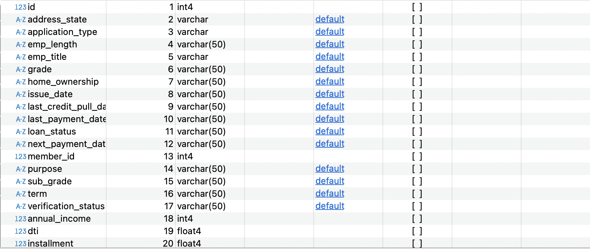

### Original Dataset Overview




#### Issues to be Addressed: <br>
1. **Date Format Conversion:** The date columns are currently stored as VARCHAR and need to be converted to the proper DATE format.
2. **Loan Term Extraction:** Loan terms are represented as string values (e.g., "36 months"), and the numerical component needs to be extracted for proper analysis.

------------------------------------------------------------------------------
### Data Preprocessing <br>

**Date columns**<br>
Ensured that all relevant date columns in the financial_loan table were properly formatted and stored as DATE values. <br>
The process involved identifying incorrectly formatted date entries, converting them to the proper format, and altering the column data types to maintain data integrity.
<details>
<summary style="color: lightblue;"> ▶▶Show code </summary>

```sql
SELECT 
	issue_date
FROM financial_loan fl
WHERE issue_date !~ '^\d{4}-\d{2}-\d{2}$';

SELECT 
	last_credit_pull_date
FROM financial_loan fl
WHERE last_credit_pull_date !~ '^\d{4}-\d{2}-\d{2}$';


SELECT 
	next_payment_date
FROM financial_loan fl
WHERE next_payment_date !~ '^\d{4}-\d{2}-\d{2}$';

SELECT 
	last_payment_date
FROM financial_loan fl
WHERE last_payment_date !~ '^\d{4}-\d{2}-\d{2}$';

ALTER TABLE financial_loan
ALTER COLUMN issue_date TYPE DATE USING TO_DATE(issue_date, 'YYYY-MM-DD'),
ALTER COLUMN last_credit_pull_date TYPE DATE USING TO_DATE(last_credit_pull_date, 'YYYY-MM-DD'),
ALTER COLUMN last_payment_date TYPE DATE USING TO_DATE(last_payment_date, 'YYYY-MM-DD'),
ALTER COLUMN next_payment_date TYPE DATE USING TO_DATE(next_payment_date, 'YYYY-MM-DD');
```
</details>
<br>

**Extract string** <br>
Extracted the first three characters from a string column and converted them to an integer using CAST and SUBSTRING functions, storing only the numeric component of the loan term.
   
<details>
<summary style="color: lightblue;">▶▶ Show code </summary>
```sql
ALTER TABLE financial_loan
ADD COLUMN term_months INTEGER;

UPDATE financial_loan
SET term_months = CAST(SUBSTRING(term FROM 1 FOR 3) AS INTEGER);
```
</details> 
