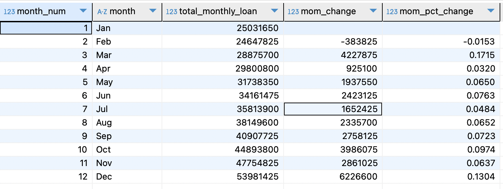
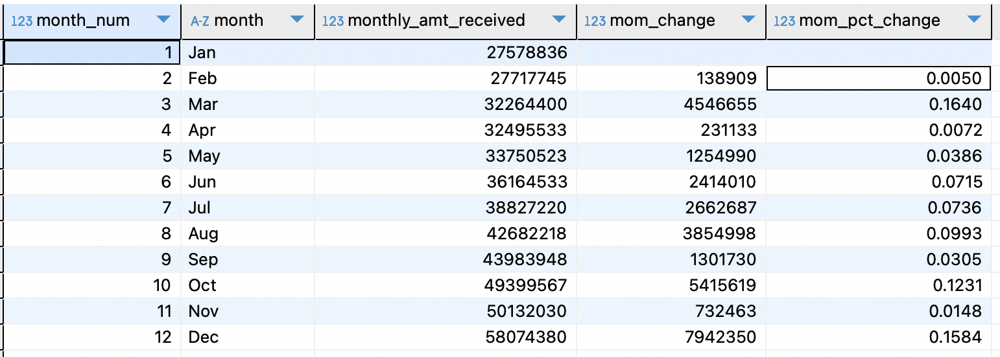

### Total Loan Applications
Calculate total loan applications, track MTD and MoM changes.

<br>

**Total Applications: 38,576**
	
```sql
SELECT COUNT(DISTINCT id) AS total_applications 
FROM financial_loan fl;
```

**Total Applications MoM changes:** <br>
Calculate monthly totals and Month-over-Month (MoM) changes using a subquery and window functions.

<details>
<summary style="color: lightblue;">▶▶Click here to show code ◀◀◀</summary>
	
```sql
SELECT 
	month_num,
	month,
	total_applications,
	(total_applications - LAG(total_applications) OVER (ORDER BY month_num))::NUMERIC AS mom_change,
	ROUND((total_applications - LAG(total_applications) OVER (ORDER BY month_num))::NUMERIC / (LAG(total_applications) OVER (ORDER BY month_num)),4) AS mom_pct_change
FROM (
SELECT 
	EXTRACT(MONTH from issue_date) AS month_num,
    	TO_CHAR(issue_date, 'Mon') AS month,
    	COUNT(DISTINCT id) AS total_applications
FROM financial_loan fl
GROUP BY EXTRACT(MONTH from issue_date), TO_CHAR(issue_date, 'Mon')
ORDER BY month_num
) AS ordered_month
ORDER BY month_num
```

### SQL Code Explanation

#### Subquery (`ordered_month`):
- **Month Extraction**:  
  - Extracts the numerical month using `EXTRACT(MONTH FROM issue_date) AS month_num`.  
  - Extracts the abbreviated month name using `TO_CHAR(issue_date, 'Mon') AS month`.  

- **Grouping and Ordering**:  
  Groups the data by `month_num` and `month` to ensure unique monthly aggregations.  
  Orders by `month_num` to maintain chronological order.  

- **Loan Application Count**:  
  Counts distinct loan application IDs for each month with `COUNT(DISTINCT id) AS total_applications`.  

#### Outer Query:
- **Absolute Month-over-Month (MoM) Change**:  
  - Calculates the MoM change using the `LAG` window function:  
    ```sql
    (total_applications - LAG(total_applications) OVER (ORDER BY month_num))::NUMERIC AS mom_change
    ```  
  - The `LAG` function retrieves the previous month's `total_applications` for each row, and the difference is cast to `NUMERIC`.

- **Percentage MoM Change**:  
  - Computes the percentage MoM change:  
    ```sql
    ROUND((total_applications - LAG(total_applications) OVER (ORDER BY month_num))::NUMERIC / (LAG(total_applications) OVER (ORDER BY month_num)), 4) AS mom_pct_change
    ```  
  - The difference in applications is divided by the previous month's total.  
  - The result is rounded to four decimal places.  
  - The `LAG` function ensures the calculation references the correct preceding row.  

#### Ordering:
- The final output is sorted by `month_num` in ascending order to maintain chronological order.

</details>


---------------------------------------------

### Total Funded Amount
Calculate total funded amount, track MTD and MoM changes.

**Total funded amount: $435,757,075**
```sql
SELECT 
	SUM(loan_amount) 
FROM financial_loan fl ;
```
**Total funded amount MoM changes:** <br>
Calculate monthly totals and Month-over-Month (MoM) changes using a subquery and window functions.
<details>
<summary style="color: lightblue;">▶▶Click here to show code ◀◀◀</summary>
	
``` sql
SELECT 
	month_num,
	month,
	total_monthly_loan,
	total_monthly_loan - LAG(total_monthly_loan) OVER(ORDER BY month_num) AS mom_change,
	ROUND((total_monthly_loan - (LAG(total_monthly_loan) OVER(ORDER BY month_num)))::NUMERIC / (LAG(total_monthly_loan) OVER(ORDER BY month_num)),4)  AS mom_pct_change
FROM (
SELECT 
	EXTRACT(MONTH from issue_date) AS month_num,
	TO_CHAR(issue_date,'Mon') AS month,
	SUM(loan_amount) AS total_monthly_loan
FROM financial_loan fl 
GROUP BY EXTRACT(MONTH from issue_date),TO_CHAR(issue_date,'Mon')
ORDER BY EXTRACT(MONTH from issue_date),TO_CHAR(issue_date,'Mon')
) AS loan_month
```

### Explanation of the SQL Code

#### Inner Query:
- **Aggregation**:  
  Aggregates loan data by month using `SUM(loan_amount)` to calculate `total_monthly_loan` for each month.  
- **Month Extraction**:  
  - Uses `EXTRACT(MONTH FROM issue_date)` to extract the numeric month (`month_num`).  
  - Uses `TO_CHAR(issue_date, 'Mon')` to extract the textual representation of the month (`month`).  
- **Grouping and Ordering**:  
  Groups by both the numeric (`month_num`) and textual (`month`) month representations for aggregation.  
  Orders the results by `month_num` to maintain chronological order.  

#### Outer Query:
- **Absolute Month-over-Month (MoM) Change**:  
  Calculates the absolute MoM change (`mom_change`) using the `LAG` window function to access the previous month's `total_monthly_loan`.  
- **Percentage MoM Change**:  
  Computes the percentage MoM change (`mom_pct_change`) by dividing `mom_change` by the previous month's value (`LAG(total_monthly_loan)`) and rounding the result to four decimal places.  

#### Window Function:
- **Usage of `LAG`**:  
  The `LAG` window function is applied with `OVER(ORDER BY month_num)` to fetch the value of `total_monthly_loan` from the previous row based on chronological order (`month_num`).  

</details>



--------------------------------------------

### Total amount received
Calculate total monthly amount received, track MTD and MoM changes.

<br>

**Total amount received: $473,070,933**
	
```sql
SELECT SUM(total_payment) AS total_received FROM financial_loan fl;
```

**Total Applications MoM changes:** <br>
Calculate monthly totals and Month-over-Month (MoM) changes using a subquery and window functions.

<details>
<summary style="color: lightblue;">▶▶Click here to show code ◀◀◀</summary>
	
```sql
SELECT 
	month_num,
	month,
	monthly_amt_received,
	monthly_amt_received - LAG(monthly_amt_received) OVER(ORDER BY month_num) AS mom_change,
	ROUND((monthly_amt_received - (LAG(monthly_amt_received) OVER(ORDER BY month_num)))::NUMERIC / (LAG(monthly_amt_received) OVER(ORDER BY month_num)),4)  AS mom_pct_change
FROM (
SELECT 
	EXTRACT(MONTH from issue_date) AS month_num,
	TO_CHAR(issue_date,'Mon') AS month,
	SUM(total_payment) AS monthly_amt_received
FROM financial_loan fl 
GROUP BY EXTRACT(MONTH from issue_date),TO_CHAR(issue_date,'Mon')
ORDER BY EXTRACT(MONTH from issue_date),TO_CHAR(issue_date,'Mon')
) AS loan_month
```

### SQL Code Explanation

#### Subquery (`loan_month`):
- **Month Extraction**:  
  - Extracts the numerical month using `EXTRACT(MONTH FROM issue_date) AS month_num`.  
  - Extracts the abbreviated month name using `TO_CHAR(issue_date, 'Mon') AS month`.  

- **Grouping and Ordering**:  
  Groups the data by `month_num` and `month` to ensure unique monthly aggregations.  
  Orders by `month_num` to maintain chronological order.  

- **Monthly Amount Received**:  
  Sums the `total_payment` column for each month with `SUM(total_payment) AS monthly_amt_received`.  

#### Outer Query:
- **Absolute Month-over-Month (MoM) Change**:  
  - Calculates the MoM change using the `LAG` window function:  
    ```sql
    monthly_amt_received - LAG(monthly_amt_received) OVER (ORDER BY month_num) AS mom_change
    ```  
  - The `LAG` function retrieves the previous month's `monthly_amt_received` for each row, and the difference is calculated.

- **Percentage MoM Change**:  
  - Computes the percentage MoM change:  
    ```sql
    ROUND((monthly_amt_received - LAG(monthly_amt_received) OVER (ORDER BY month_num))::NUMERIC / (LAG(monthly_amt_received) OVER (ORDER BY month_num)), 4) AS mom_pct_change
    ```  
  - The difference in received amounts is divided by the previous month's total.  
  - The result is cast to `NUMERIC` and rounded to four decimal places.  
  - The `LAG` function ensures the calculation references the correct preceding row.  

#### Ordering:
- The final output is sorted by `month_num` in ascending order to maintain chronological order.


</details>



--------------------------------------------

### Average interest rate
Calculate the average interest rate across all loans and MoM changes.

**Average interest rate: 12.05% / 0.1205**

```sql
SELECT ROUND(AVG(int_rate)::NUMERIC,4) FROM financial_loan fl
```
