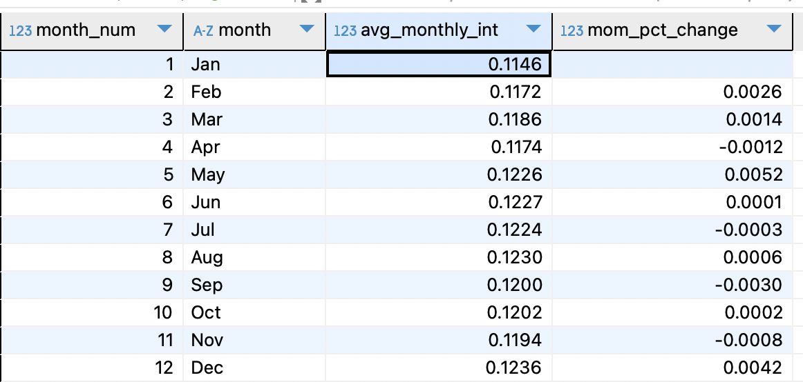
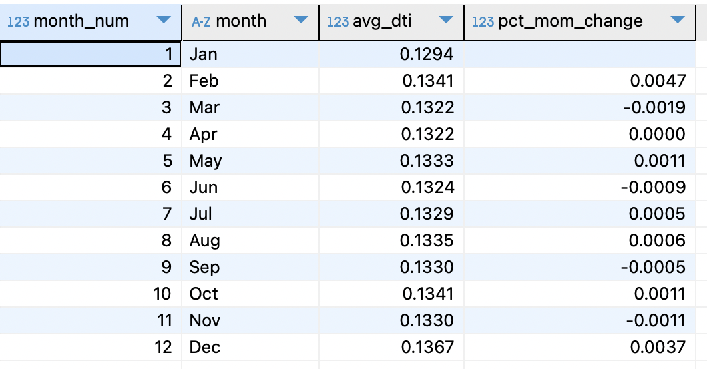
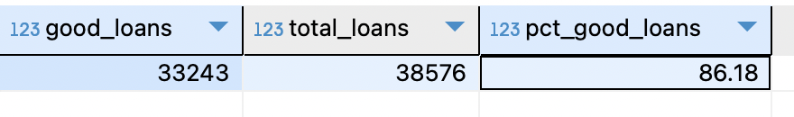
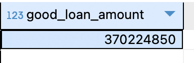
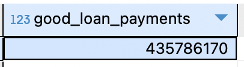

### Total Loan Applications
Calculate total loan applications, track MTD and MoM changes.

<br>

**Total Applications: 38,576**
	
```sql
SELECT COUNT(DISTINCT id) AS total_applications 
FROM financial_loan fl;
```

**Total Applications MoM changes:** <br>
Calculate monthly totals and Month-over-Month (MoM) changes using a subquery and window functions.

<details>
<summary style="color: lightblue;">▶▶Click here to show code ◀◀◀</summary>
	
```sql
SELECT 
	month_num,
	month,
	total_applications,
	(total_applications - LAG(total_applications) OVER (ORDER BY month_num))::NUMERIC AS mom_change,
	ROUND((total_applications - LAG(total_applications) OVER (ORDER BY month_num))::NUMERIC / (LAG(total_applications) OVER (ORDER BY month_num)),4) AS mom_pct_change
FROM (
SELECT 
	EXTRACT(MONTH from issue_date) AS month_num,
    	TO_CHAR(issue_date, 'Mon') AS month,
    	COUNT(DISTINCT id) AS total_applications
FROM financial_loan fl
GROUP BY EXTRACT(MONTH from issue_date), TO_CHAR(issue_date, 'Mon')
ORDER BY month_num
) AS ordered_month
ORDER BY month_num
```

### SQL Code Explanation

#### Subquery (`ordered_month`):
- **Month Extraction**:  
  - Extracts the numerical month using `EXTRACT(MONTH FROM issue_date) AS month_num`.  
  - Extracts the abbreviated month name using `TO_CHAR(issue_date, 'Mon') AS month`.
  - This allows chronological ordering by month.


- **Grouping and Ordering**:  
  Groups the data by `month_num` and `month` to ensure unique monthly aggregations.  
  Orders by `month_num` to maintain chronological order.  

- **Loan Application Count**:  
  Counts distinct loan application IDs for each month with `COUNT(DISTINCT id) AS total_applications`.  

#### Outer Query:
- **Absolute Month-over-Month (MoM) Change**:  
  - Calculates the MoM change using the `LAG` window function:  
    ```sql
    (total_applications - LAG(total_applications) OVER (ORDER BY month_num))::NUMERIC AS mom_change
    ```  
  - The `LAG` function retrieves the previous month's `total_applications` for each row, and the difference is cast to `NUMERIC`.

- **Percentage MoM Change**:  
  - Computes the percentage MoM change:  
    ```sql
    ROUND((total_applications - LAG(total_applications) OVER (ORDER BY month_num))::NUMERIC / (LAG(total_applications) OVER (ORDER BY month_num)), 4) AS mom_pct_change
    ```  
  - The difference in applications is divided by the previous month's total.  
  - The result is rounded to four decimal places.  
  - The `LAG` function ensures the calculation references the correct preceding row.  

#### Ordering:
- The final output is sorted by `month_num` in ascending order to maintain chronological order.

</details>


---------------------------------------------

### Total Funded Amount
Calculate total funded amount, track MTD and MoM changes.

**Total funded amount: $435,757,075**
```sql
SELECT 
	SUM(loan_amount) 
FROM financial_loan fl ;
```
**Total funded amount MoM changes:** <br>
Calculate monthly totals and Month-over-Month (MoM) changes using a subquery and window functions.
<details>
<summary style="color: lightblue;">▶▶Click here to show code ◀◀◀</summary>
	
``` sql
SELECT 
	month_num,
	month,
	total_monthly_loan,
	total_monthly_loan - LAG(total_monthly_loan) OVER(ORDER BY month_num) AS mom_change,
	ROUND((total_monthly_loan - (LAG(total_monthly_loan) OVER(ORDER BY month_num)))::NUMERIC / (LAG(total_monthly_loan) OVER(ORDER BY month_num)),4)  AS mom_pct_change
FROM (
SELECT 
	EXTRACT(MONTH from issue_date) AS month_num,
	TO_CHAR(issue_date,'Mon') AS month,
	SUM(loan_amount) AS total_monthly_loan
FROM financial_loan fl 
GROUP BY EXTRACT(MONTH from issue_date),TO_CHAR(issue_date,'Mon')
ORDER BY EXTRACT(MONTH from issue_date),TO_CHAR(issue_date,'Mon')
) AS loan_month
```

### Explanation of the SQL Code

#### Inner Query:
- **Aggregation**:  
  Aggregates loan data by month using `SUM(loan_amount)` to calculate `total_monthly_loan` for each month.  
- **Month Extraction**:  
  - Uses `EXTRACT(MONTH FROM issue_date)` to extract the numeric month (`month_num`).  
  - Uses `TO_CHAR(issue_date, 'Mon')` to extract the textual representation of the month (`month`).  
- **Grouping and Ordering**:  
  Groups by both the numeric (`month_num`) and textual (`month`) month representations for aggregation.  
  Orders the results by `month_num` to maintain chronological order.  

#### Outer Query:
- **Absolute Month-over-Month (MoM) Change**:  
  Calculates the absolute MoM change (`mom_change`) using the `LAG` window function to access the previous month's `total_monthly_loan`.  
- **Percentage MoM Change**:  
  Computes the percentage MoM change (`mom_pct_change`) by dividing `mom_change` by the previous month's value (`LAG(total_monthly_loan)`) and rounding the result to four decimal places.  

#### Window Function:
- **Usage of `LAG`**:  
  The `LAG` window function is applied with `OVER(ORDER BY month_num)` to fetch the value of `total_monthly_loan` from the previous row based on chronological order (`month_num`).  

</details>


--------------------------------------------

### Total amount received
Calculate total monthly amount received, track MTD and MoM changes.

<br>

**Total amount received: $473,070,933**
	
```sql
SELECT SUM(total_payment) AS total_received FROM financial_loan fl;
```

**Total Applications MoM changes:** <br>
Calculate monthly totals and Month-over-Month (MoM) changes using a subquery and window functions.

<details>
<summary style="color: lightblue;">▶▶Click here to show code ◀◀◀</summary>
	
```sql
SELECT 
	month_num,
	month,
	monthly_amt_received,
	monthly_amt_received - LAG(monthly_amt_received) OVER(ORDER BY month_num) AS mom_change,
	ROUND((monthly_amt_received - (LAG(monthly_amt_received) OVER(ORDER BY month_num)))::NUMERIC / (LAG(monthly_amt_received) OVER(ORDER BY month_num)),4)  AS mom_pct_change
FROM (
SELECT 
	EXTRACT(MONTH from issue_date) AS month_num,
	TO_CHAR(issue_date,'Mon') AS month,
	SUM(total_payment) AS monthly_amt_received
FROM financial_loan fl 
GROUP BY EXTRACT(MONTH from issue_date),TO_CHAR(issue_date,'Mon')
ORDER BY EXTRACT(MONTH from issue_date),TO_CHAR(issue_date,'Mon')
) AS loan_month
```

### SQL Code Explanation

#### Subquery (`loan_month`):
- **Month Extraction**:  
  - Extracts the numerical month using `EXTRACT(MONTH FROM issue_date) AS month_num`.  
  - Extracts the abbreviated month name using `TO_CHAR(issue_date, 'Mon') AS month`.  

- **Grouping and Ordering**:  
  Groups the data by `month_num` and `month` to ensure unique monthly aggregations.  
  Orders by `month_num` to maintain chronological order.  

- **Monthly Amount Received**:  
  Sums the `total_payment` column for each month with `SUM(total_payment) AS monthly_amt_received`.  

#### Outer Query:
- **Absolute Month-over-Month (MoM) Change**:  
  - Calculates the MoM change using the `LAG` window function:  
    ```sql
    monthly_amt_received - LAG(monthly_amt_received) OVER (ORDER BY month_num) AS mom_change
    ```  
  - The `LAG` function retrieves the previous month's `monthly_amt_received` for each row, and the difference is calculated.

- **Percentage MoM Change**:  
  - Computes the percentage MoM change:  
    ```sql
    ROUND((monthly_amt_received - LAG(monthly_amt_received) OVER (ORDER BY month_num))::NUMERIC / (LAG(monthly_amt_received) OVER (ORDER BY month_num)), 4) AS mom_pct_change
    ```  
  - The difference in received amounts is divided by the previous month's total.  
  - The result is cast to `NUMERIC` and rounded to four decimal places.  
  - The `LAG` function ensures the calculation references the correct preceding row.  

#### Ordering:
- The final output is sorted by `month_num` in ascending order to maintain chronological order.


</details>


--------------------------------------------

### Average interest rate
Calculate the average interest rate across all loans and MoM changes.

**Average interest rate: 12.05% / 0.1205**

```sql
SELECT ROUND(AVG(int_rate)::NUMERIC,4) FROM financial_loan fl
```
**Average interest rate MoM:** <br>
Calculate average interest and Month-over-Month (MoM) changes using a subquery and window LAG function.

<details>
<summary style="color: lightblue;">▶▶Click here to show code ◀◀◀</summary>
	
```sql
SELECT 
	month_num,
	month,
	avg_monthly_int, 
	ROUND((avg_monthly_int - (LAG(avg_monthly_int) OVER(ORDER BY month_num))),4) AS mom_pct_change
FROM (
SELECT 
	EXTRACT(MONTH from issue_date) AS month_num,
	TO_CHAR(issue_date, 'Mon') AS month,
	ROUND(AVG(int_rate)::NUMERIC,4) AS avg_monthly_int
FROM financial_loan fl 
GROUP BY EXTRACT(MONTH from issue_date), TO_CHAR(issue_date, 'Mon')
ORDER BY month_num, month
) AS mthly_int
```

### SQL Code Explanation

#### Subquery (`mthly_int`):
- **Month Extraction**:  
  - Extracts the numerical month using `EXTRACT(MONTH FROM issue_date) AS month_num`.  
  - Extracts the abbreviated month name using `TO_CHAR(issue_date, 'Mon') AS month`.
  - This allows chronological ordering by month.
  
- **Average Monthly Interest Rate**:  
  - Calculates the average interest rate for each month using:  
    ```sql
    ROUND(AVG(int_rate)::NUMERIC, 4) AS avg_monthly_int
    ```  
  - This averages the `int_rate` column values, rounding the result to four decimal places to get the `avg_monthly_int`.
  
- **Grouping and Ordering**:  
  - Groups the data by `month_num` and `month` to ensure unique monthly aggregations.  
  - Orders by `month_num` to maintain chronological order of the months.
  
#### Outer Query:
- **Month-over-Month (MoM) Change**:  
  - Calculates the MoM change in the average interest rate using the `LAG` window function:  
    ```sql
    ROUND((avg_monthly_int - (LAG(avg_monthly_int) OVER(ORDER BY month_num))), 4) AS mom_pct_change
    ```  
  - The `LAG` function retrieves the previous month's `avg_monthly_int` for each row, and the difference is computed to find the MoM change.
  - The result is rounded to four decimal places.

#### Final Output:
- **Ordering**:  
  - The final output is sorted by `month_num` in ascending order to maintain chronological order of the months.
  
This structure ensures that the average monthly interest rate is calculated per month and that the MoM percentage change is correctly computed.

</details>



--------------------------------------------

### Average Debt-to-Income Ratio (DTI)
Evaluate the average DTI of borrowers, track Month-over-Month (MoM) fluctuations.

**Average DTI: 13.33% / 0.1333**
```sql
SELECT ROUND(AVG(dti)::NUMERIC,4) AS avg_dti FROM financial_loan fl 
```
**Average DTI MoM changes:** <br>
Calculate monthly average and Month-over-Month (MoM) changes using a subquery and window LAG function.

<details>
<summary style="color: lightblue;">▶▶Click here to show code ◀◀◀</summary>

``` sql
SELECT
	month_num,
	month,
	avg_dti,
	avg_dti - (LAG(avg_dti) OVER(ORDER BY month_num)) AS pct_mom_change
FROM (
SELECT 
	EXTRACT(MONTH FROM issue_date) AS month_num,
	TO_CHAR(issue_date, 'Mon') AS month,
	ROUND(AVG(dti)::NUMERIC,4) AS avg_dti
FROM financial_loan fl 
GROUP BY EXTRACT(MONTH FROM issue_date), TO_CHAR(issue_date, 'Mon')
ORDER BY month_num, month
) AS mnthly_dti
 ```

### SQL Code Explanation

#### Subquery (`mnthly_dti`):
- **Month Extraction**:  
  - Extracts the numerical month using `EXTRACT(MONTH FROM issue_date) AS month_num`.  
  - Extracts the abbreviated month name using `TO_CHAR(issue_date, 'Mon') AS month`.
  - This allows chronological ordering by month.
  - 
- **Debt-to-Income Ratio (DTI) Calculation**:  
  - The average is rounded to four decimal places, using `ROUND(AVG(dti)::NUMERIC, 4) AS avg_dti`.

- **Grouping and Ordering**:  
  - Groups the data by `month_num` and `month` to calculate the monthly average DTI.  
  - Orders the results by `month_num` and `month` to maintain chronological order.

#### Outer Query:
- **Month-over-Month (MoM) Percentage Change in DTI**:  
  - Calculates the absolute MoM change in the average DTI using:  
    ```sql
    avg_dti - (LAG(avg_dti) OVER(ORDER BY month_num)) AS pct_mom_change
    ```  
  - The `LAG` window function retrieves the previous month's `avg_dti` for each row.  
  - Subtracting the previous month's `avg_dti` from the current month's `avg_dti` gives the change.  

#### Ordering:
- The final output is sorted by `month_num` in ascending order to ensure the data is presented in chronological order.

This query computes the average monthly Debt-to-Income Ratio (DTI) and tracks the month-over-month changes to highlight trends in borrower debt levels over time.

</details>



--------------------------------------------


# Good Loan v Bad Loan KPI’s

***Good Loan KPIs:***
- **Good Loan Application Percentage**: 86.18% <br> 'Good Loans' are loans with a loan status of 'Fully Paid' and 'Current.'

<details>
<summary style="color: lightblue;">▶▶Click here to show code ◀◀◀</summary>

``` sql
SELECT 
	good_loans,
	total_loans,
	ROUND(good_loans * 100.00 / total_loans,2) AS pct_good_loans
FROM (
SELECT 
	COUNT(
		CASE WHEN loan_status = 'Fully Paid' OR loan_status = 'Current'
		THEN 'id' END) AS good_loans,
	COUNT(id) AS total_loans
FROM financial_loan fl 
) AS count_good_loans

 ```

### SQL Code Explanation

#### Subquery (`count_good_loans`):
- **Loan Status Classification**:  
  - Uses a `CASE` expression to classify loans as "good loans" based on their `loan_status`:  
    - Includes loans with `loan_status = 'Fully Paid' or 'Current'`.  
    - If the condition is met, assigns `'id'` to the `CASE` expression.  
    - The `COUNT` function aggregates these qualified rows, returning the total number as `good_loans`.  

    ```sql
    COUNT(
      CASE WHEN loan_status = 'Fully Paid' OR loan_status = 'Current'
      THEN 'id' END) AS good_loans
    ```

- **Total Loan Count**:  
  - Uses `COUNT(id)` to calculate the total number of loans in the dataset as `total_loans`.  

#### Outer Query:
- **Percentage of Good Loans**:  
  - Calculates the percentage of good loans relative to total loans:  
    ```sql
    ROUND(good_loans * 100.00 / total_loans, 2) AS pct_good_loans
    ```
    - Multiplies `good_loans` by 100.00 to obtain a percentage.  
    - Divides by `total_loans` for normalization.  
    - Uses the `ROUND` function to limit the result to two decimal places for readability.  

#### Aliasing:
- The subquery is aliased as `count_good_loans`, allowing its columns (`good_loans` and `total_loans`) to be referenced in the outer query.  

</details>



---------------------------------------

- **Good Loan Funded Amount**: $370,224,850 <br> Determine the total amount of funds disbursed as 'Good Loans.'

``` sql
SELECT
	SUM(loan_amount)
FROM financial_loan fl
WHERE loan_status = 'Current' OR loan_status = 'Fully Paid'

 ```
<details>
<summary style="color: lightblue;">▶▶Click here for code explanation ◀◀◀</summary>

### SQL Code Explanation

#### Query Overview:
- **Summing Loan Amounts**:  
  - Uses the `SUM` aggregate function to calculate the total `loan_amount` for loans meeting specific conditions.  

#### Filtering with `WHERE` Clause:
- **Loan Status Filtering**:  
  - Filters rows based on the `loan_status` column:  
    - Includes only loans with `loan_status = 'Current'` or `loan_status = 'Fully Paid'`.  
    - The `OR` logical operator ensures that rows matching either condition are selected.  

    ```sql
    WHERE loan_status = 'Current' OR loan_status = 'Fully Paid'
    ```

#### Aggregate Function:
- **Summation**:  
  - Applies the `SUM` function to the `loan_amount` column.  
  - Aggregates the values of `loan_amount` for the filtered rows, returning the total loan amount.  

    ```sql
    SUM(loan_amount)
    ```

#### Output:
- Returns a single value representing the total loan amount for loans classified as either "Current" or "Fully Paid".  

</details>



---------------------------------------

- **Good Loan received Amount**: $435,786,170 <br> Determine the total amount of funds disbursed as 'Good Loans.'

``` sql
SELECT
	SUM(total_payment) AS good_loan_payments
FROM financial_loan fl
WHERE loan_status = 'Current' OR loan_status = 'Fully Paid'

 ```
<details>
<summary style="color: lightblue;">▶▶Click here for code explanation ◀◀◀</summary>

### SQL Code Explanation

#### Query Overview:
- **Summing Total Payments for Good Loans**:  
  - `SUM` aggregate function to calculate the total `total_payment` for loans classified as "good loans."  
  - Aliases the resulting value as `good_loan_payments` for clarity and readability.  

#### Filtering with `WHERE` Clause:
- **Loan Status Filtering**:  
  - Filters rows based on the `loan_status` column:  
    - Includes only loans with `loan_status = 'Current'` or `loan_status = 'Fully Paid'`.  
    - The `OR` logical operator ensures rows satisfying either condition are included in the computation.  

    ```sql
    WHERE loan_status = 'Current' OR loan_status = 'Fully Paid'
    ```

#### Aggregate Function:
- **Summation**:  
  - Applies the `SUM` function to the `total_payment` column.  
  - Aggregates the values of `total_payment` for all filtered rows, providing the cumulative amount of payments made for good loans.  

    ```sql
    SUM(total_payment) AS good_loan_payments
    ```

#### Output:
- Returns a single value, representing the total payments made for good loans


</details>



