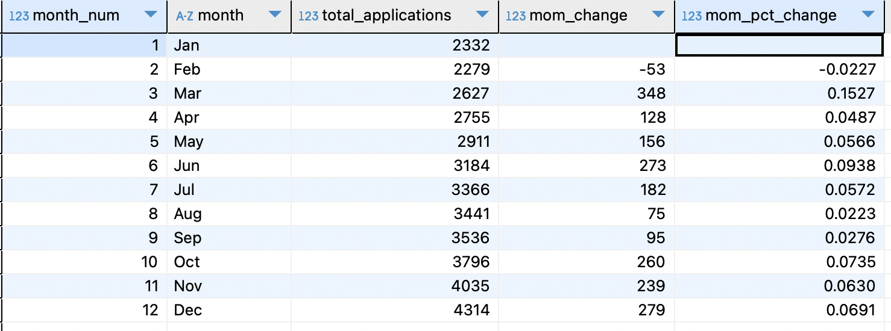

### Total Loan Applications
**Objective:** Calculate total loan applications for a specified period, track MTD, and MoM changes.

**Total Applications:** **38,576**
	
```sql
SELECT COUNT(DISTINCT id) AS total_applications 
FROM financial_loan fl;
```

**MTD, and MoM changes:**<br>
Using GROUP BY & window functions, month-on-month(MoM) changes were calculated.

<details>
<summary style="color: lightblue;">▶▶Show code </summary>
	
```sql
SELECT 
	month_num,
	month,
	total_applications,
	(total_applications - LAG(total_applications) OVER (ORDER BY month_num))::NUMERIC AS mom_change,
	ROUND((total_applications - LAG(total_applications) OVER (ORDER BY month_num))::NUMERIC / (LAG(total_applications) OVER (ORDER BY month_num)),4) AS mom_pct_change
FROM (
SELECT 
	EXTRACT(MONTH from issue_date) AS month_num,
    TO_CHAR(issue_date, 'Mon') AS month,
    COUNT(DISTINCT id) AS total_applications
FROM financial_loan fl
GROUP BY EXTRACT(MONTH from issue_date), TO_CHAR(issue_date, 'Mon')
ORDER BY month_num
) AS ordered_month
ORDER BY month_num
```
</details>


