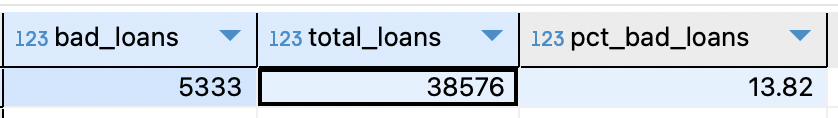
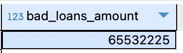
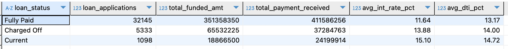
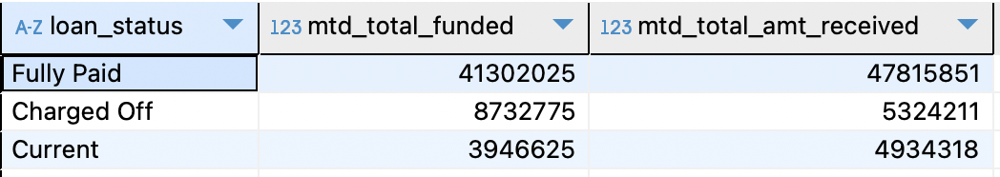
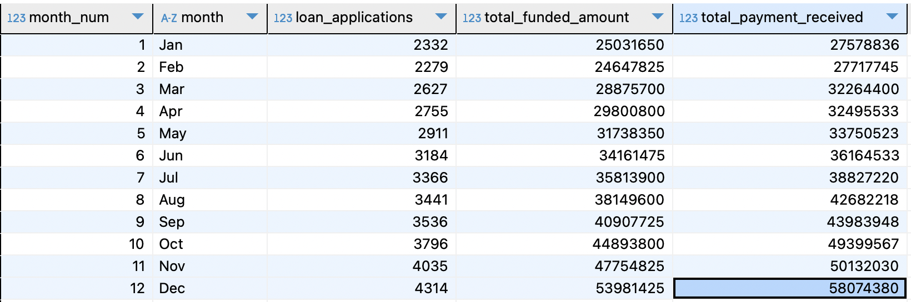
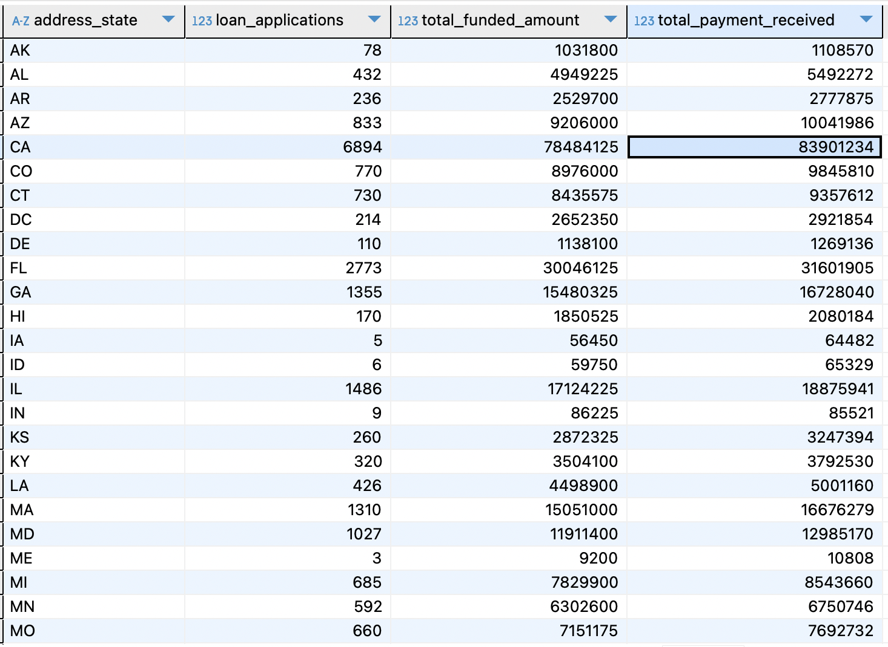
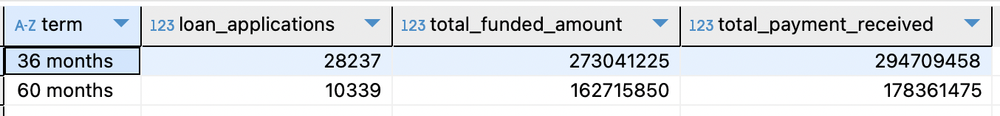
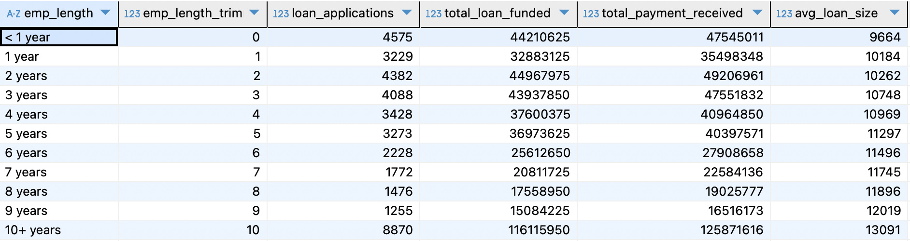
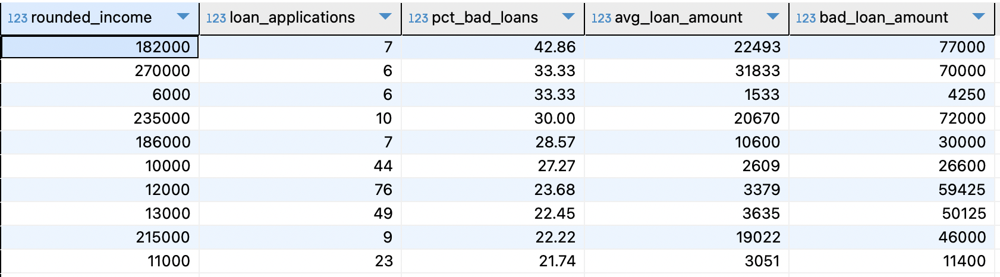

- [SQL functions used](-kpis)
	- [GROUP BY](#total-applications-mom-changes)
   	- [Sub-query](#total-funded-amount-mom-changes)


# Overview KPIs

### Total Loan Applications
Calculate total loan applications, track MTD and MoM changes.

<br>

#### Total Applications: 38,576**
	
```sql
SELECT COUNT(DISTINCT id) AS total_applications 
FROM financial_loan fl;
```
<br>
<br>

#### Total Applications MoM changes:

Month-over-month trend analysis using SQL window functions.

<details>
<summary style="color: lightblue;">▶▶Click here to show code ◀◀◀</summary>
	
```sql
SELECT 
	month_num,
	month,
	total_applications,
	(total_applications - LAG(total_applications) OVER (ORDER BY month_num))::NUMERIC AS mom_change,
	ROUND((total_applications - LAG(total_applications) OVER (ORDER BY month_num))::NUMERIC / (LAG(total_applications) OVER (ORDER BY month_num)),4) AS mom_pct_change
FROM (
SELECT 
	EXTRACT(MONTH from issue_date) AS month_num,
    	TO_CHAR(issue_date, 'Mon') AS month,
    	COUNT(DISTINCT id) AS total_applications
FROM financial_loan fl
GROUP BY EXTRACT(MONTH from issue_date), TO_CHAR(issue_date, 'Mon')
ORDER BY month_num
) AS ordered_month
ORDER BY month_num
```

### SQL Code Explanation

### Explanation of Code

1. **Aggregation and Month Extraction**: <br>
The inner query calculates monthly loan totals (`SUM(loan_amount) AS total_monthly_loan`) and extracts numeric and textual month values using `EXTRACT(MONTH)` and `TO_CHAR`.  
2. **Chronological Ordering**: <br>
Results are grouped and ordered by month_num to maintain the timeline.
4. **MoM Absolute Change**: <br>
The outer query calculates `mom_change` using `LAG(total_monthly_loan)` to fetch the previous month’s total.
6. **MoM Percentage Change**: <br>
Computes `mom_pct_change` by dividing `mom_change` by the prior month’s loan total and rounding it.


</details>


<br>
<br>

---------------------------------------------

### Total Funded Amount
Calculate total funded amount, track MTD and MoM changes.

#### Total funded amount: $435,757,075
```sql
SELECT 
	SUM(loan_amount) 
FROM financial_loan fl ;
```
<br>
<br>

#### Total funded amount MoM changes:
Calculate monthly totals and Month-over-Month (MoM) changes using a subquery and window functions.
<details>
<summary style="color: lightblue;">▶▶Click here to show code ◀◀◀</summary>
	
``` sql
SELECT 
	month_num,
	month,
	total_monthly_loan,
	total_monthly_loan - LAG(total_monthly_loan) OVER(ORDER BY month_num) AS mom_change,
	ROUND((total_monthly_loan - (LAG(total_monthly_loan) OVER(ORDER BY month_num)))::NUMERIC / (LAG(total_monthly_loan) OVER(ORDER BY month_num)),4)  AS mom_pct_change
FROM (
SELECT 
	EXTRACT(MONTH from issue_date) AS month_num,
	TO_CHAR(issue_date,'Mon') AS month,
	SUM(loan_amount) AS total_monthly_loan
FROM financial_loan fl 
GROUP BY EXTRACT(MONTH from issue_date),TO_CHAR(issue_date,'Mon')
ORDER BY EXTRACT(MONTH from issue_date),TO_CHAR(issue_date,'Mon')
) AS loan_month
```

### Explanation of SQL Code

#### Inner Query:
- **Aggregation**:  
  The loan data is aggregated by month using `SUM(loan_amount)`, calculating the `total_monthly_loan` for each month.

- **Month Extraction**:  
  - `EXTRACT(MONTH FROM issue_date)` is used to extract the numeric representation of the month (`month_num`).
  - `TO_CHAR(issue_date, 'Mon')` is used to extract the textual representation of the month (`month`).

- **Grouping and Ordering**:  
  The query groups by both the numeric (`month_num`) and textual (`month`) month representations.  
  It then orders the results by `month_num` to ensure the data is sorted chronologically.

#### Outer Query:
- **Absolute Month-over-Month (MoM) Change**:  
  The absolute MoM change (`mom_change`) is calculated using the `LAG()` window function. This function accesses the `total_monthly_loan` value from the previous month.

- **Percentage MoM Change**:  
  The percentage MoM change (`mom_pct_change`) is computed by dividing the absolute change (`mom_change`) by the previous month's value, using `LAG(total_monthly_loan)`. The result is rounded to four decimal places.

#### Window Function:
- **Usage of `LAG()`**:  
  The `LAG()` window function is applied with `OVER(ORDER BY month_num)` to retrieve the `total_monthly_loan` from the previous row, allowing comparisons across months in chronological order.


</details>


<br>
<br>

--------------------------------------------

### Total amount received
Calculate total monthly amount received, track MTD and MoM changes.

<br>

**1. Total amount received: $473,070,933**
	
```sql
SELECT SUM(total_payment) AS total_received FROM financial_loan fl;
```
<br>
<br>

**2. Total Applications MoM changes:** <br>
Calculate monthly totals and Month-over-Month (MoM) changes using a subquery and window functions.

<details>
<summary style="color: lightblue;">▶▶Click here to show code ◀◀◀</summary>
	
```sql
SELECT 
	month_num,
	month,
	monthly_amt_received,
	monthly_amt_received - LAG(monthly_amt_received) OVER(ORDER BY month_num) AS mom_change,
	ROUND((monthly_amt_received - (LAG(monthly_amt_received) OVER(ORDER BY month_num)))::NUMERIC / (LAG(monthly_amt_received) OVER(ORDER BY month_num)),4)  AS mom_pct_change
FROM (
SELECT 
	EXTRACT(MONTH from issue_date) AS month_num,
	TO_CHAR(issue_date,'Mon') AS month,
	SUM(total_payment) AS monthly_amt_received
FROM financial_loan fl 
GROUP BY EXTRACT(MONTH from issue_date),TO_CHAR(issue_date,'Mon')
ORDER BY EXTRACT(MONTH from issue_date),TO_CHAR(issue_date,'Mon')
) AS loan_month
```

### SQL Code Explanation

#### Subquery (`loan_month`):
- **Month Extraction**:  
  - Extracts the numerical month using `EXTRACT(MONTH FROM issue_date) AS month_num`.  
  - Extracts the abbreviated month name using `TO_CHAR(issue_date, 'Mon') AS month`.  

- **Grouping and Ordering**:  
  Groups the data by `month_num` and `month` to ensure unique monthly aggregations.  
  Orders by `month_num` to maintain chronological order.  

- **Monthly Amount Received**:  
  Sums the `total_payment` column for each month with `SUM(total_payment) AS monthly_amt_received`.  

#### Outer Query:
- **Absolute Month-over-Month (MoM) Change**:  
  - Calculates the MoM change using the `LAG` window function:  
    ```sql
    monthly_amt_received - LAG(monthly_amt_received) OVER (ORDER BY month_num) AS mom_change
    ```  
  - The `LAG` function retrieves the previous month's `monthly_amt_received` for each row, and the difference is calculated.

- **Percentage MoM Change**:  
  - Computes the percentage MoM change:  
    ```sql
    ROUND((monthly_amt_received - LAG(monthly_amt_received) OVER (ORDER BY month_num))::NUMERIC / (LAG(monthly_amt_received) OVER (ORDER BY month_num)), 4) AS mom_pct_change
    ```  
  - The difference in received amounts is divided by the previous month's total.  
  - The result is cast to `NUMERIC` and rounded to four decimal places.  
  - The `LAG` function ensures the calculation references the correct preceding row.  

</details>


<br>
<br>

--------------------------------------------

### Average interest rate
Calculate the average interest rate across all loans and MoM changes.

**1. Average interest rate: 12.05%**

```sql
SELECT ROUND(AVG(int_rate)::NUMERIC,4) FROM financial_loan fl
```
<br>
<br>

**2. Average interest rate MoM:** <br>
Calculate average interest and Month-over-Month (MoM) changes using a subquery and window LAG function.

<details>
<summary style="color: lightblue;">▶▶Click here to show code ◀◀◀</summary>
	
```sql
SELECT 
	month_num,
	month,
	avg_monthly_int, 
	ROUND((avg_monthly_int - (LAG(avg_monthly_int) OVER(ORDER BY month_num))),4) AS mom_pct_change
FROM (
SELECT 
	EXTRACT(MONTH from issue_date) AS month_num,
	TO_CHAR(issue_date, 'Mon') AS month,
	ROUND(AVG(int_rate)::NUMERIC,4) AS avg_monthly_int
FROM financial_loan fl 
GROUP BY EXTRACT(MONTH from issue_date), TO_CHAR(issue_date, 'Mon')
ORDER BY month_num, month
) AS mthly_int
```

### SQL Code Explanation

#### Subquery (`mthly_int`):
- **Month Extraction**:  
  - Extracts the numerical month using `EXTRACT(MONTH FROM issue_date) AS month_num`.  
  - Extracts the abbreviated month name using `TO_CHAR(issue_date, 'Mon') AS month`.
  - This allows chronological ordering by month.
  
- **Average Monthly Interest Rate**:  
  - Calculates the average interest rate for each month using:  
    ```sql
    ROUND(AVG(int_rate)::NUMERIC, 4) AS avg_monthly_int
    ```  
  - This averages the `int_rate` column values, rounding the result to four decimal places to get the `avg_monthly_int`.
  
- **Grouping and Ordering**:  
  - Groups the data by `month_num` and `month` to ensure unique monthly aggregations.  
  - Orders by `month_num` to maintain chronological order of the months.
  
#### Outer Query:
- **Month-over-Month (MoM) Change**:  
  - Calculates the MoM change in the average interest rate using the `LAG` window function:  
    ```sql
    ROUND((avg_monthly_int - (LAG(avg_monthly_int) OVER(ORDER BY month_num))), 4) AS mom_pct_change
    ```  
  - The `LAG` function retrieves the previous month's `avg_monthly_int` for each row, and the difference is computed to find the MoM change.
  - The result is rounded to four decimal places.

</details>


<br>
<br>

--------------------------------------------

### Average Debt-to-Income Ratio (DTI)
Evaluate the average DTI of borrowers, track Month-over-Month (MoM) fluctuations.

**1. Average DTI: 13.33%**
```sql
SELECT ROUND(AVG(dti)::NUMERIC,4) AS avg_dti FROM financial_loan fl 
```
<br>
<br>

**2. Average DTI MoM changes:** <br>
Calculate monthly average and Month-over-Month (MoM) changes using a subquery and window LAG function.

<details>
<summary style="color: lightblue;">▶▶Click here to show code ◀◀◀</summary>

``` sql
SELECT
	month_num,
	month,
	avg_dti,
	avg_dti - (LAG(avg_dti) OVER(ORDER BY month_num)) AS pct_mom_change
FROM (
SELECT 
	EXTRACT(MONTH FROM issue_date) AS month_num,
	TO_CHAR(issue_date, 'Mon') AS month,
	ROUND(AVG(dti)::NUMERIC,4) AS avg_dti
FROM financial_loan fl 
GROUP BY EXTRACT(MONTH FROM issue_date), TO_CHAR(issue_date, 'Mon')
ORDER BY month_num, month
) AS mnthly_dti
 ```

### SQL Code Explanation

#### Subquery (`mnthly_dti`):
- **Month Extraction**:  
  - Extracts the numerical month using `EXTRACT(MONTH FROM issue_date) AS month_num`.  
  - Extracts the abbreviated month name using `TO_CHAR(issue_date, 'Mon') AS month`.
  - This allows chronological ordering by month.
  - 
- **Debt-to-Income Ratio (DTI) Calculation**:  
  - The average is rounded to four decimal places, using `ROUND(AVG(dti)::NUMERIC, 4) AS avg_dti`.

- **Grouping and Ordering**:  
  - Groups the data by `month_num` and `month` to calculate the monthly average DTI.  
  - Orders the results by `month_num` and `month` to maintain chronological order.

#### Outer Query:
- **Month-over-Month (MoM) Percentage Change in DTI**:  
  - Calculates the absolute MoM change in the average DTI using:  
    ```sql
    avg_dti - (LAG(avg_dti) OVER(ORDER BY month_num)) AS pct_mom_change
    ```  
  - The `LAG` window function retrieves the previous month's `avg_dti` for each row.  
  - Subtracting the previous month's `avg_dti` from the current month's `avg_dti` gives the change.  

#### Ordering:
- The final output is sorted by `month_num` in ascending order to ensure the data is presented in chronological order.

</details>


<br>
<br>

--------------------------------------------


# Good Loan v Bad Loan KPI’s

***Good Loan KPIs:***
- **1. Good Loan Application Percentage: 86.18%** <br> Loan status of 'Fully Paid' and 'Current.'

<details>
<summary style="color: lightblue;">▶▶Click here to show code ◀◀◀</summary>

``` sql
SELECT 
	good_loans,
	total_loans,
	ROUND(good_loans * 100.00 / total_loans,2) AS pct_good_loans
FROM (
SELECT 
	COUNT(
		CASE WHEN loan_status = 'Fully Paid' OR loan_status = 'Current'
		THEN 'id' END) AS good_loans,
	COUNT(id) AS total_loans
FROM financial_loan fl 
) AS count_good_loans

 ```

### SQL Code Explanation

#### Subquery (`count_good_loans`):
- **Loan Status Classification**:  
  - Uses a `CASE` expression to classify loans as "good loans" based on their `loan_status`:  
    - Includes loans with `loan_status = 'Fully Paid' or 'Current'`.  
    - If the condition is met, assigns `'id'` to the `CASE` expression.  
    - The `COUNT` function aggregates these qualified rows, returning the total number as `good_loans`.  

    ```sql
    COUNT(
      CASE WHEN loan_status = 'Fully Paid' OR loan_status = 'Current'
      THEN 'id' END) AS good_loans
    ```

- **Total Loan Count**:  
  - Uses `COUNT(id)` to calculate the total number of loans in the dataset as `total_loans`.  

#### Outer Query:
- **Percentage of Good Loans**:  
  - Calculates the percentage of good loans relative to total loans:  
    ```sql
    ROUND(good_loans * 100.00 / total_loans, 2) AS pct_good_loans
    ```
    - Multiplies `good_loans` by 100.00 to obtain a percentage.  
    - Uses the `ROUND` function to limit the result to two decimal places for readability.  

</details>


<br>
<br>

- **2. Good Loan Funded Amount: $370,224,850** <br> Determine the total amount of funds disbursed as 'Good Loans.'

``` sql
SELECT
	SUM(loan_amount)
FROM financial_loan fl
WHERE loan_status = 'Current' OR loan_status = 'Fully Paid'

 ```
<details>
<summary style="color: lightblue;">▶▶Click here for code explanation ◀◀◀</summary>

### SQL Code Explanation

#### Query Overview:
- **Summing Loan Amounts**:  
  - Uses the `SUM` aggregate function to calculate the total `loan_amount` for loans meeting specific conditions.  

#### Filtering with `WHERE` Clause:
- **Loan Status Filtering**:  
  - Filters rows based on the `loan_status` column:  
    - Includes only loans with `loan_status = 'Current'` or `loan_status = 'Fully Paid'`.  
    - The `OR` logical operator ensures that rows matching either condition are selected.  

    ```sql
    WHERE loan_status = 'Current' OR loan_status = 'Fully Paid'
    ```

#### Aggregate Function:
- **Summation**:  
  - Applies the `SUM` function to the `loan_amount` column.  
  - Aggregates the values of `loan_amount` for the filtered rows, returning the total loan amount.  

    ```sql
    SUM(loan_amount)
    ```

#### Output:
- Returns a single value representing the total loan amount for loans classified as either "Current" or "Fully Paid".  

</details>


<br>
<br>

- **3. Good Loan received Amount: $435,786,170** <br> Determine the total amount of funds disbursed as 'Good Loans.'

``` sql
SELECT
	SUM(total_payment) AS good_loan_payments
FROM financial_loan fl
WHERE loan_status = 'Current' OR loan_status = 'Fully Paid'

 ```
<details>
<summary style="color: lightblue;">▶▶Click here for code explanation ◀◀◀</summary>

### SQL Code Explanation

#### Query Overview:
- **Summing Total Payments for Good Loans**:  
  - `SUM` aggregate function to calculate the total `total_payment` for loans classified as "good loans."  
  - Aliases the resulting value as `good_loan_payments` for clarity and readability.  

#### Filtering with `WHERE` Clause:
- **Loan Status Filtering**:  
  - Filters rows based on the `loan_status` column:  
    - Includes only loans with `loan_status = 'Current'` or `loan_status = 'Fully Paid'`.  
    - The `OR` logical operator ensures rows satisfying either condition are included in the computation.  

    ```sql
    WHERE loan_status = 'Current' OR loan_status = 'Fully Paid'
    ```

#### Aggregate Function:
- **Summation**:  
  - Applies the `SUM` function to the `total_payment` column.  
  - Aggregates the values of `total_payment` for all filtered rows, providing the cumulative amount of payments made for good loans.  

    ```sql
    SUM(total_payment) AS good_loan_payments
    ```

#### Output:
- Returns a single value, representing the total payments made for good loans


</details>


<br>
<br>

----------------------------
***Bad Loan KPIs:***

**1. Bad Loan Application Percentage: 13.82%** <br>
Loan status of 'Charged Off.'

<details>
<summary style="color: lightblue;">▶▶Click here to show code ◀◀◀</summary>

``` sql
SELECT 
	bad_loans,
	total_loans,
	ROUND((bad_loans * 100.00 / total_loans),2) AS pct_bad_loans
FROM (
SELECT 
	COUNT(
		CASE WHEN loan_status = 'Charged Off' THEN 'id' END) AS bad_loans,
	COUNT(id) AS total_loans
FROM financial_loan fl 
) AS count_bad_loans

 ```
### SQL Code Explanation

#### Subquery (`count_bad_loans`):
- **Loan Status Classification**:  
  - Utilizes a `CASE` expression to classify loans as "bad loans" based on their `loan_status`:  
    - Includes loans with `loan_status = 'Charged Off'`.  
    - If the condition is met, assigns `'id'` to the `CASE` expression.  
    - The `COUNT` function aggregates these qualified rows, producing the total number of "bad loans" as `bad_loans`.  

    ```sql
    COUNT(
      CASE WHEN loan_status = 'Charged Off' THEN 'id' END) AS bad_loans
    ```

- **Total Loan Count**:  
  - Uses `COUNT(id)` to calculate the total number of loans in the dataset as `total_loans`.  

#### Outer Query:
- **Percentage of Bad Loans**:  
  - Calculates the percentage of bad loans relative to the total loans:  
    ```sql
    ROUND((bad_loans * 100.00 / total_loans), 2) AS pct_bad_loans
    ```
    - The `ROUND` function ensures the result is rounded to two decimal places for readability.  


#### Output:
- The query returns three columns:  
  - `bad_loans`: The count of loans classified as "bad."  
  - `total_loans`: The total number of loans.  
  - `pct_bad_loans`: The percentage of bad loans, rounded to two decimal places.  

</details>


<br>
<br>

**2. Bad loans amount: $65,532,225** <br> Determining the total amount of funds disbursed as 'Bad Loans.'

``` sql
SELECT 
	SUM(loan_amount) AS bad_loans_amount
FROM financial_loan fl 
WHERE loan_status = 'Charged Off'
```


<br>
<br>

**3. Bad Loan Total Received Amount: $37,284,763** <br> Total amount received from borrowers for 'Bad Loans'

``` sql
SELECT 
	SUM(total_payment) AS bad_loans_received
FROM financial_loan fl 
WHERE loan_status = 'Charged Off'
```
<br>

------------------------------------------------------------------------
------------------------------------------------------------------------
<br>

### Loan Status Grid View Report

Categorize loans by status, providing key metrics for monitoring portfolio performance for a clear assessment of portfolio health.:

- **Total Loan Applications**  
- **Total Funded Amount** & **Total Amount Received**  
- **Month-to-Date (MTD) Funded Amount** & **MTD Amount Received**  
- **Average Interest Rate** & **Debt-to-Income Ratio (DTI)**
<br>

#### Totals:


``` sql
SELECT 
	loan_status, 
	COUNT(id) AS loan_applications,
	SUM(loan_amount) AS total_funded_amt,
	SUM(total_payment) AS total_payment_received,
	ROUND(AVG(int_rate * 100)::NUMERIC,2) AS avg_int_rate_pct,
	ROUND(AVG(dti * 100)::NUMERIC,2)  AS avg_dti_pct
FROM financial_loan fl 
GROUP BY loan_status
ORDER BY loan_applications DESC
```
<br>

#### MTD:


``` sql
SELECT 
	loan_status, 
	SUM(loan_amount) AS  mtd_total_funded,
	SUM(total_payment) AS mtd_total_amt_received
FROM financial_loan fl2 
WHERE EXTRACT(MONTH FROM issue_date) = (SELECT MAX(EXTRACT(MONTH from issue_date)) FROM financial_loan fl)
GROUP BY loan_status
ORDER BY mtd_total_funded DESC
```
------------
------------

## Key loan metrics
Analyse key loan metrics and trends, providing a clear understanding of lending operations and uncovering critical insights.

### 1. Monthly Trends by Issue Date  
Identify seasonality and long-term lending trends.  

``` sql 
SELECT 
	EXTRACT(MONTH FROM issue_date) AS month_num,
	TO_CHAR(issue_date, 'Mon') AS month,
	COUNT(id) AS loan_applications,
	SUM(loan_amount) AS total_funded_amount,
	SUM(total_payment) AS total_payment_received
FROM financial_loan fl 
GROUP BY EXTRACT(MONTH FROM issue_date), TO_CHAR(issue_date, 'Mon')
ORDER BY month_num, month
```



### 2. Regional by State  
Analyze lending activity across states to identify regions with significant activity and assess regional disparities.  

``` sql 
SELECT 
	address_state,
	COUNT(id) AS loan_applications,
	SUM(loan_amount) AS total_funded_amount,
	SUM(total_payment) AS total_payment_received
FROM financial_loan fl 
GROUP BY address_state
ORDER BY address_state
```



### 3. Loan Term   
Show loan distribution based on term lengths, providing insights into the popularity and performance of different loan terms.  

```sql
SELECT 
	term ,
	COUNT(id) AS loan_applications,
	SUM(loan_amount) AS total_funded_amount,
	SUM(total_payment) AS total_payment_received
FROM financial_loan fl 
GROUP BY term
ORDER BY term
```


### 4. Employment Length Analysis  
How lending metrics vary among borrowers with different employment lengths to understand the impact of employment history on loan behavior.  

```sql
WITH cte AS 
(SELECT 
	*,
    CASE 
        WHEN emp_length_trim ~ '^[0-9]+$' THEN CAST(emp_length_trim AS INTEGER) 
        ELSE 0 END AS emp_length_trimmed
FROM(
SELECT 
	*,
	TRIM(LEFT(emp_length,2)) AS emp_length_trim
FROM financial_loan fl 
) AS emp_length_column
)

SELECT 
	emp_length,
	emp_length_trimmed,
	COUNT(id) AS loan_applications,
	SUM(loan_amount) AS total_loan_funded,
	SUM(total_payment) AS total_payment_received,
	ROUND(AVG(loan_amount),0) AS avg_loan_size
FROM cte 
GROUP BY emp_length, emp_length_trimmed
ORDER BY emp_length_trimmed, emp_length
```



### 5. Top 10 Income brackets with highest % of Bad loans
How loan performance varies across different income brackets to assess the relationship between annual income and loan behavior.

``` sql
SELECT 
	rounded_income,
	COUNT(ID) AS loan_applications,
	ROUND(COUNT(CASE WHEN loan_status = 'Charged Off' THEN 'id' END) / COUNT(ID)::NUMERIC *100,2) AS pct_bad_loans,
	ROUND(AVG(loan_amount),0) AS avg_loan_amount,
	SUM(CASE WHEN loan_status = 'Charged Off' THEN loan_amount END) AS bad_loan_amount
FROM (
SELECT 
	*,
	ROUND(annual_income,-3) AS rounded_income
FROM financial_loan fl 
) AS income_bracket
GROUP BY rounded_income
HAVING COUNT(ID) >= 5
ORDER BY pct_bad_loans DESC, avg_loan_amount DESC, loan_applications DESC
LIMIT 10
```


