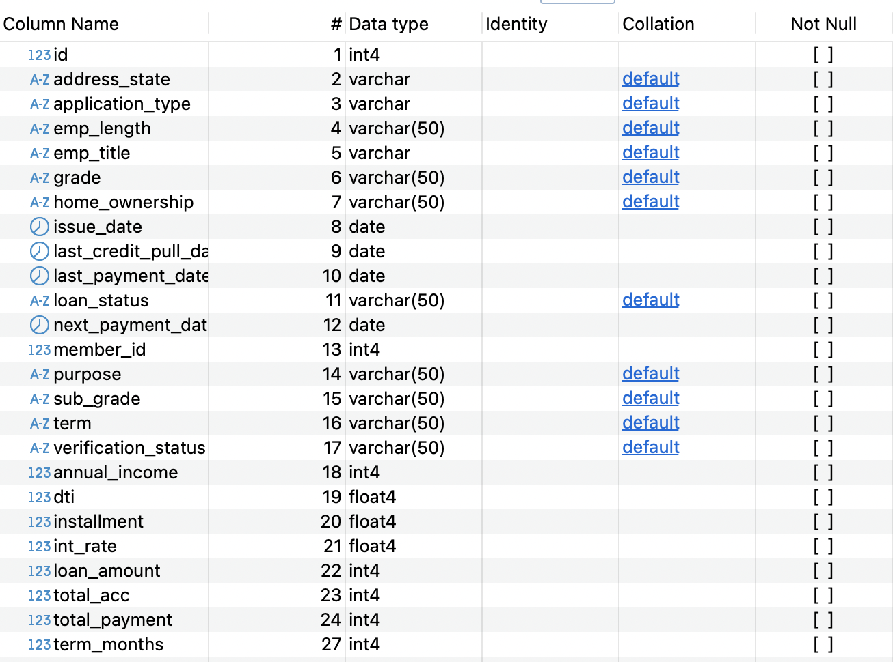

### Table Of Contents

- [Overview KPIs](#overview-kpis)
- [Orginal Dataset](#original-dataset-overview)
  - [Issues with dataset](#issues-with-dataset)
- [Data Preprocessing](#data-preprocessing)
- [Processed Dataset](#processed-dataset-overview)

## What do we want to achieve with this report?

To monitor and evaluate lending activities and performance effectively. <br><br>
By providing key loan metrics and insights into trends over time, the report aims to track portfolio health and support the development of data-driven lending strategies, ensuring informed decision-making and sustainable growth.


------------------------------------------------------------------------


### Key Performance Indicators (KPIs) Requirements:

1. **Total Loan Applications**: Calculate the total number of loan applications received during a specified period. Additionally, monitor the Month-to-Date (MTD) Loan Applications and track changes Month-over-Month (MoM).

2. **Total Funded Amount**: Understanding the total amount of funds disbursed as loans is crucial. We also want to keep an eye on the MTD Total Funded Amount and analyse the Month-over-Month (MoM) changes in this metric.

3. **Total Amount Received**: Track the total amount received from borrowers for assessing the bank's cash flow and loan repayment. We should analyse the Month-to-Date (MTD) Total Amount Received and observe the Month-over-Month (MoM) changes.

4. **Average Interest Rate**: Calculate the average interest rate across all loans, MTD, and monitoring the Month-over-Month (MoM) variations in interest rates will provide insights into our lending portfolio's overall cost.

5. **Average Debt-to-Income Ratio (DTI)**: Evaluate the average DTI for our borrowers to help us gauge their financial health. Compute the average DTI for all loans, MTD, and track Month-over-Month (MoM) fluctuations.
------------------------------------------------------------------------


### Good Loan v Bad Loan KPI’s 
In order to evaluate the performance of our lending activities and assess the quality of our loan portfolio

***Good Loan KPIs:***
1. **Good Loan Application Percentage**: We need to calculate the percentage of loan applications classified as 'Good Loans.' This category includes loans with a loan status of 'Fully Paid' and 'Current.'
2. **Good Loan Funded Amount**: Determining the total amount of funds disbursed as 'Good Loans.' This includes the principal amounts of loans with a loan status of 'Fully Paid' and 'Current.'
3. **Good Loan Total Received Amount**: Tracking the total amount received from borrowers for 'Good Loans,' which encompasses all payments made on loans with a loan status of 'Fully Paid' and 'Current.'

***Bad Loan KPIs:***
1. **Bad Loan Application Percentage**: Calculating the percentage of loan applications categorized as 'Bad Loans.' This category specifically includes loans with a loan status of 'Charged Off.'
2. **Bad Loan Funded Amount**: Determining the total amount of funds disbursed as 'Bad Loans.' This comprises the principal amounts of loans with a loan status of 'Charged Off.'
3. **Bad Loan Total Received Amount**: Tracking the total amount received from borrowers for 'Bad Loans,' which includes all payments made on loans with a loan status of 'Charged Off.'

------------------------------------------------------------------------
<br>

### Loan Status Grid View Report

The **Loan Status Grid View** report categorizes loans by status, providing key metrics for monitoring portfolio performance:

- **Total Loan Applications**  
- **Total Funded Amount** & **Total Amount Received**  
- **Month-to-Date (MTD) Funded Amount** & **MTD Amount Received**  
- **Average Interest Rate** & **Debt-to-Income Ratio (DTI)**  

This report enables data-driven decisions and a clear assessment of portfolio health.

------------------------------------------------------------------------
------------------------------------------------------------------------

## Key loan metrics

Analyse key loan metrics and trends, providing a clear understanding of lending operations and uncovering critical insights.


### 1. Monthly Trends by Issue Date  
Identify seasonality and long-term lending trends.  
* _**Metrics**: Total Loan Applications, Total Funded Amount, Total Amount Received_


### 2. Regional Analysis by State  
Analyze lending activity across states to identify regions with significant activity and assess regional disparities.  
* _**Metrics**: Total Loan Applications, Total Funded Amount, Total Amount Received_


### 3. Loan Term Analysis  
Show loan distribution based on term lengths, providing insights into the popularity and performance of different loan terms.  
* _**Metrics**: Total Loan Applications, Total Funded Amount, Total Amount Received_


### 4. Employment Length Analysis  
How lending metrics vary among borrowers with different employment lengths to understand the impact of employment history on loan behavior.  
* _**Metrics**: Total Loan Applications, Total Funded Amount, Total Amount Received_


### 5. Loan Purpose Breakdown  
Provide a detailed breakdown of loans based on their stated purposes to understand why borrowers seek financing.  
* _**Metrics**: Total Loan Applications, Total Funded Amount, Total Amount Received_


### 6. Home Ownership Analysis  
Categorize loan metrics by home ownership status to assess its influence on loan applications and disbursements.  
* _**Metrics**: Total Loan Applications, Total Funded Amount, Total Amount Received_  

------------------------------------------------------------------------------
------------------------------------------------------------------------------

### Original Dataset Overview


#### Issues with dataset

<br>

1. **Date Format Conversion:** The date columns are currently stored as VARCHAR and need to be converted to the proper DATE format.
2. **Loan Term Extraction:** Loan terms are represented as string values (e.g., "36 months"), and the numerical component needs to be extracted for proper analysis.

------------------------------------------------------------------------------
### Data Preprocessing 

<br>

- **Date Columns**  
  - Ensured all relevant date columns in the `financial_loan` table were properly formatted as DATE values.  
  - Identified and corrected incorrectly formatted date entries.  
  - Converted dates to the correct format.  
  - Updated column data types to maintain data integrity. 

<details>
<summary style="color: lightblue;"> ▶▶Show code </summary>

```sql
SELECT 
	issue_date
FROM financial_loan fl
WHERE issue_date !~ '^\d{4}-\d{2}-\d{2}$';

SELECT 
	last_credit_pull_date
FROM financial_loan fl
WHERE last_credit_pull_date !~ '^\d{4}-\d{2}-\d{2}$';


SELECT 
	next_payment_date
FROM financial_loan fl
WHERE next_payment_date !~ '^\d{4}-\d{2}-\d{2}$';

SELECT 
	last_payment_date
FROM financial_loan fl
WHERE last_payment_date !~ '^\d{4}-\d{2}-\d{2}$';

ALTER TABLE financial_loan
ALTER COLUMN issue_date TYPE DATE USING TO_DATE(issue_date, 'YYYY-MM-DD'),
ALTER COLUMN last_credit_pull_date TYPE DATE USING TO_DATE(last_credit_pull_date, 'YYYY-MM-DD'),
ALTER COLUMN last_payment_date TYPE DATE USING TO_DATE(last_payment_date, 'YYYY-MM-DD'),
ALTER COLUMN next_payment_date TYPE DATE USING TO_DATE(next_payment_date, 'YYYY-MM-DD');
```
</details>
<br>

- **Extracting String Data**  
  - Extracted the first three characters from a string column using the `SUBSTRING` function.  
  - Converted the extracted characters into integers using the `CAST` function.  
  - Stored only the numeric component of the loan term for further processing.  
<details>
<summary style="color: lightblue;">▶▶ Show code </summary>
	
```sql
ALTER TABLE financial_loan
ADD COLUMN term_months INTEGER;

UPDATE financial_loan
SET term_months = CAST(SUBSTRING(term FROM 1 FOR 3) AS INTEGER);
```
</details> 

------------------------------------------------------------------------------


### Processed Dataset Overview


