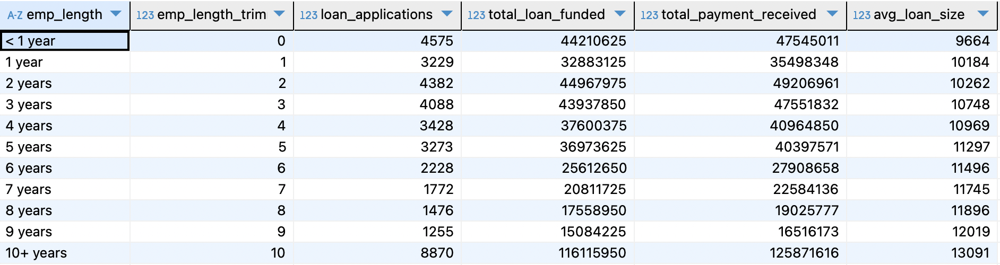

## Report 2: Key loan metrics
Analyse key loan metrics and trends, providing a clear understanding of lending operations and uncovering critical insights.

### 1. Monthly Trends by Issue Date  
Identify seasonality and long-term lending trends.  

``` sql 
SELECT 
	EXTRACT(MONTH FROM issue_date) AS month_num,
	TO_CHAR(issue_date, 'Mon') AS month,
	COUNT(id) AS loan_applications,
	SUM(loan_amount) AS total_funded_amount,
	SUM(total_payment) AS total_payment_received
FROM financial_loan fl 
GROUP BY EXTRACT(MONTH FROM issue_date), TO_CHAR(issue_date, 'Mon')
ORDER BY month_num, month
```


### 2. Regional by State  
Analyze lending activity across states to identify regions with significant activity and assess regional disparities.  

``` sql 
SELECT 
	address_state,
	COUNT(id) AS loan_applications,
	SUM(loan_amount) AS total_funded_amount,
	SUM(total_payment) AS total_payment_received
FROM financial_loan fl 
GROUP BY address_state
ORDER BY address_state
```


### 3. Loan Term   
Show loan distribution based on term lengths, providing insights into the popularity and performance of different loan terms.  

```sql
SELECT 
	term ,
	COUNT(id) AS loan_applications,
	SUM(loan_amount) AS total_funded_amount,
	SUM(total_payment) AS total_payment_received
FROM financial_loan fl 
GROUP BY term
ORDER BY term
```


### 4. Employment Length Analysis  
How lending metrics vary among borrowers with different employment lengths to understand the impact of employment history on loan behavior.  

```sql
WITH cte AS 
(SELECT 
	*,
    CASE 
        WHEN emp_length_trim ~ '^[0-9]+$' THEN CAST(emp_length_trim AS INTEGER) 
        ELSE 0 END AS emp_length_trimmed
FROM(
SELECT 
	*,
	TRIM(LEFT(emp_length,2)) AS emp_length_trim
FROM financial_loan fl 
) AS emp_length_column
)

SELECT 
	emp_length,
	emp_length_trimmed,
	COUNT(id) AS loan_applications,
	SUM(loan_amount) AS total_loan_funded,
	SUM(total_payment) AS total_payment_received,
	ROUND(AVG(loan_amount),0) AS avg_loan_size
FROM cte 
GROUP BY emp_length, emp_length_trimmed
ORDER BY emp_length_trimmed, emp_length
```


