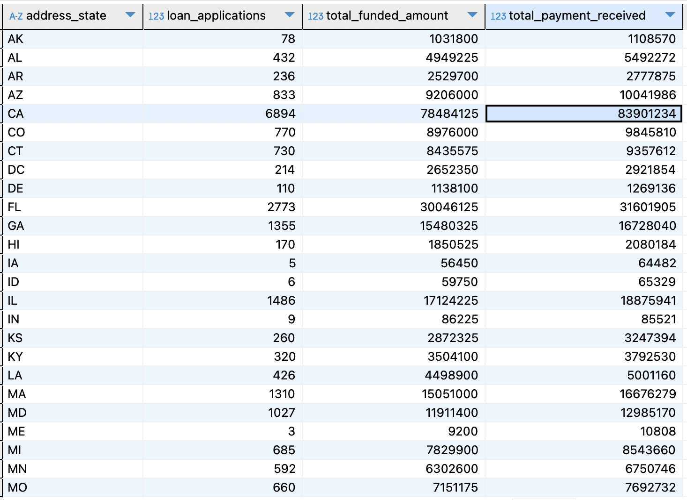

## Report 2: Key loan metrics
Analyse key loan metrics and trends, providing a clear understanding of lending operations and uncovering critical insights.

### 1. Monthly Trends by Issue Date  
Identify seasonality and long-term lending trends.  

``` sql 
SELECT 
	EXTRACT(MONTH FROM issue_date) AS month_num,
	TO_CHAR(issue_date, 'Mon') AS month,
	COUNT(id) AS loan_applications,
	SUM(loan_amount) AS total_funded_amount,
	SUM(total_payment) AS total_payment_received
FROM financial_loan fl 
GROUP BY EXTRACT(MONTH FROM issue_date), TO_CHAR(issue_date, 'Mon')
ORDER BY month_num, month
```


### 2. Regional Analysis by State  
Analyze lending activity across states to identify regions with significant activity and assess regional disparities.  

``` sql 
SELECT 
	address_state,
	COUNT(id) AS loan_applications,
	SUM(loan_amount) AS total_funded_amount,
	SUM(total_payment) AS total_payment_received
FROM financial_loan fl 
GROUP BY address_state
ORDER BY address_state
```



### 3. Loan Term Analysis  
Show loan distribution based on term lengths, providing insights into the popularity and performance of different loan terms.  

```sql
SELECT 
	term ,
	COUNT(id) AS loan_applications,
	SUM(loan_amount) AS total_funded_amount,
	SUM(total_payment) AS total_payment_received
FROM financial_loan fl 
GROUP BY term
ORDER BY term
```


